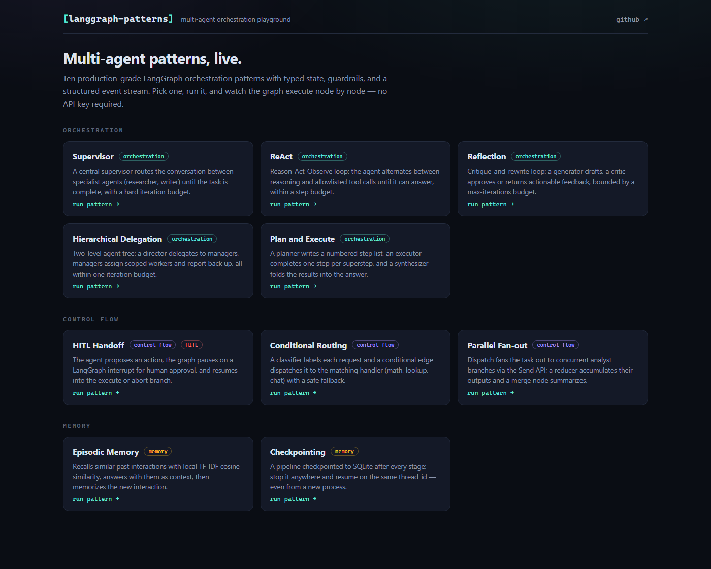
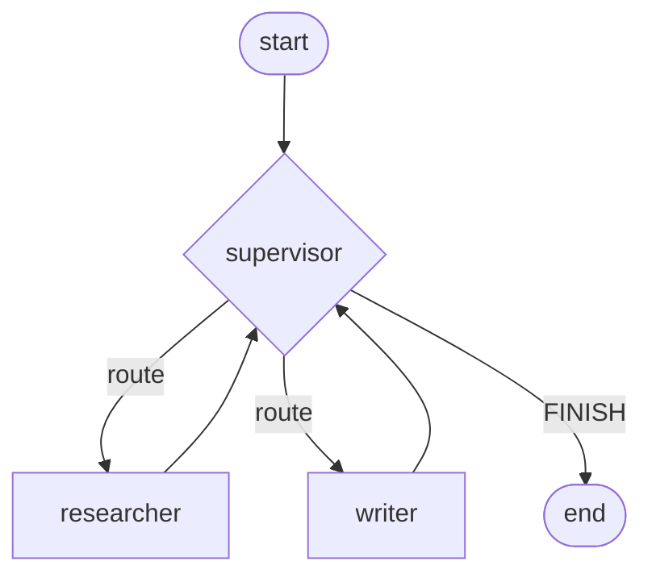
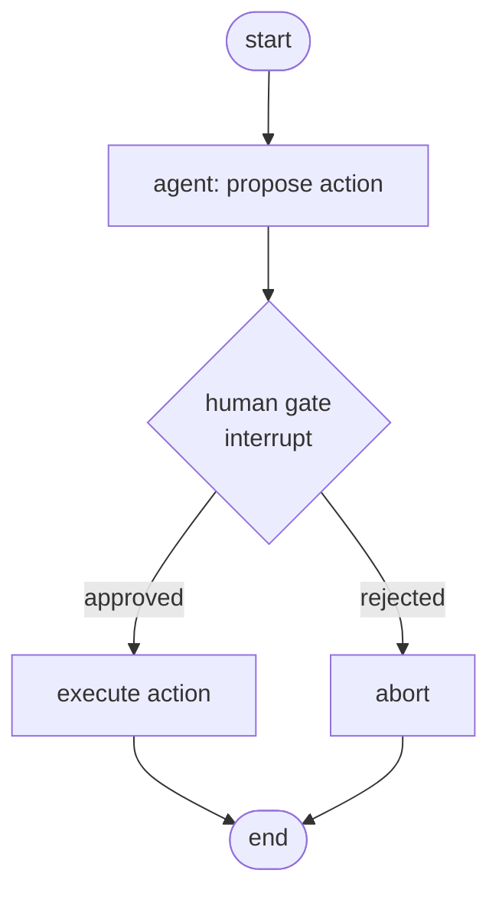
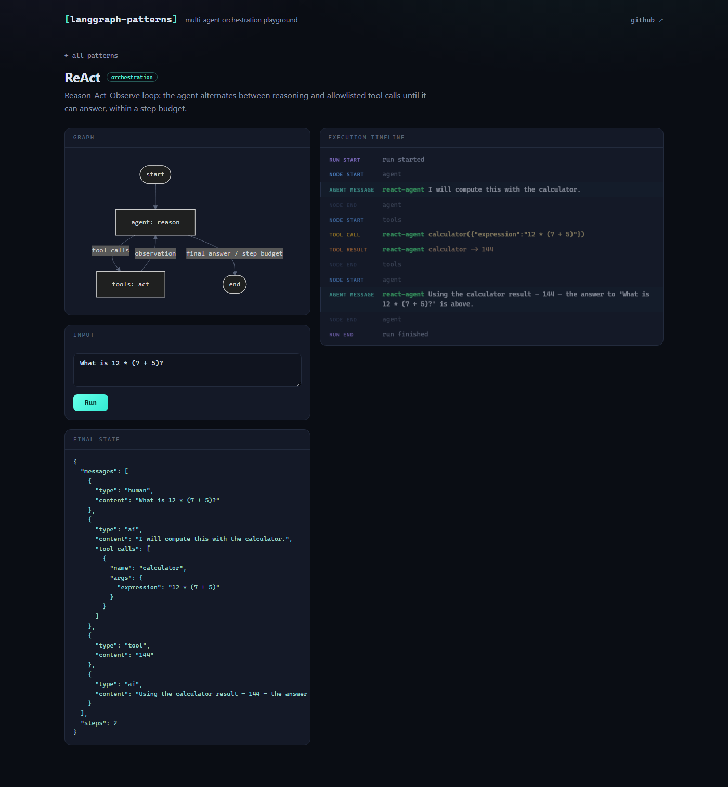
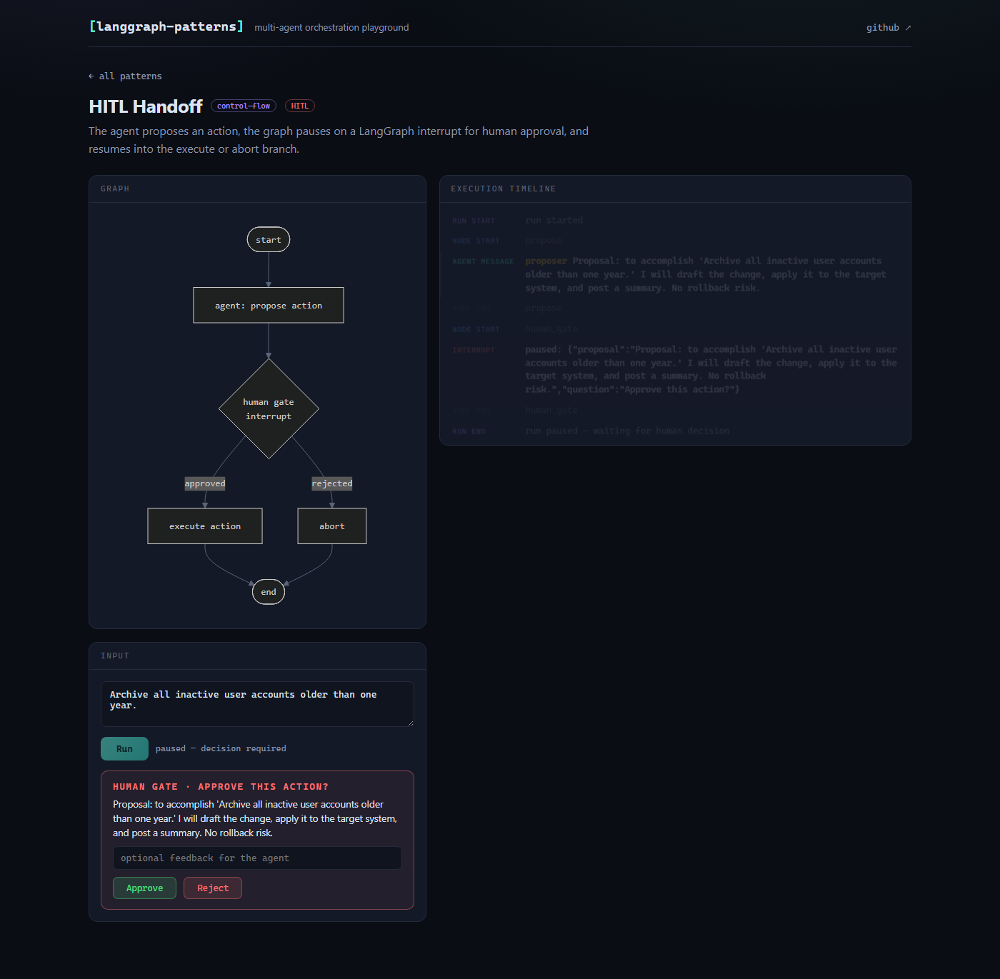

# LangGraph Multi-Agent Patterns

[](https://github.com/praveenpke/multiagent-patterns/actions/workflows/ci.yml)

A Python library of production-grade [LangGraph](https://github.com/langchain-ai/langgraph) multi-agent orchestration patterns, plus an interactive React playground to run every pattern and watch its execution live.

Every pattern is a **factory function** returning a compiled LangGraph graph with:

- a **typed Pydantic state schema**
- a **Mermaid diagram** and docstring
- **guardrails**: max-iteration/step budgets and per-agent tool allowlists
- a **structured event stream** (`node_start`, `agent_message`, `tool_call`, `interrupt`, ...) via one shared `stream_events()` helper

**No API key required.** With `ANTHROPIC_API_KEY` set, patterns run against Anthropic Claude (`claude-opus-4-8` by default). Without it, every pattern runs on deterministic scripted fake models — so the examples, the test suite, and the playground all work keyless and offline.



## Pattern catalog

| Pattern | Category | Factory | What it shows |
|---|---|---|---|
| **Supervisor** | Orchestration | `patterns.supervisor.build_supervisor` | Central router delegates to specialist subagents until done |
| **Hierarchical Delegation** | Orchestration | `patterns.hierarchical.build_hierarchical` | Two-level tree: director → managers → scoped workers |
| **Reflection** | Orchestration | `patterns.reflection.build_reflection` | Critique-and-rewrite loop with max-iterations budget |
| **Plan and Execute** | Orchestration | `patterns.plan_execute.build_plan_execute` | Planner writes steps; executor runs one per superstep; synthesizer merges |
| **ReAct** | Orchestration | `patterns.react.build_react` | Reason-Act-Observe loop with allowlisted tools |
| **HITL Handoff** | Control flow | `patterns.hitl.build_hitl` | `interrupt()` pause for human approval; resume with `Command(resume=...)` |
| **Conditional Routing** | Control flow | `patterns.routing.build_routing` | Classifier output picks the edge (math / lookup / chat) with fallback |
| **Parallel Fan-out** | Control flow | `patterns.fanout.build_fanout` | `Send` API runs analysts concurrently; reducer merges results |
| **Episodic Memory** | Memory | `memory.episodic.build_episodic` | TF-IDF similarity recall over past interactions — fully local |
| **Checkpointing** | Memory | `memory.checkpointing.build_checkpointing` | SQLite checkpoints; resume mid-pipeline, even from a new process |

Shared typed state is a property of every pattern: each graph declares a Pydantic schema (`SupervisorState`, `ReActState`, ...) that all nodes read and update.

Example diagrams (each pattern ships its own as `MERMAID`):





## Quickstart

Requires Python 3.11+ and [uv](https://docs.astral.sh/uv/) (or plain `pip`).

```bash
git clone https://github.com/praveenpke/multiagent-patterns.git
cd multiagent-patterns
uv sync --all-extras          # or: pip install -e ".[anthropic,playground]"

# run the tests (keyless — fake models)
uv run pytest

# run any pattern example
cd examples
uv run python supervisor_example.py
uv run python hitl_example.py
uv run python checkpointing_example.py
```

Optional — real models: copy `.env.example` to `.env` and set `ANTHROPIC_API_KEY` (export it in your shell), and the same code runs against Claude.

## Using the library

```python
from langgraph_patterns.patterns.supervisor import build_supervisor, make_input
from langgraph_patterns.events import stream_events, run_pattern

graph = build_supervisor(max_iterations=6)

# stream structured events as the graph runs
for event in stream_events(graph, make_input("Explain multi-agent trade-offs.")):
    print(event.type, event.node or event.agent, event.data)

# or collect everything at once
result = run_pattern(graph, make_input("Explain multi-agent trade-offs."))
print(result.final_state["messages"][-1]["content"])
```

Bring your own agents and tools:

```python
from langgraph_patterns.patterns.supervisor import AgentSpec, build_supervisor
from langgraph_patterns.patterns.react import build_react
from langgraph_patterns.tools import calculator

graph = build_supervisor(agents=[
    AgentSpec(name="analyst", description="crunches numbers",
              system_prompt="You analyze data."),
    AgentSpec(name="reporter", description="writes the summary",
              system_prompt="You write the final report."),
])

# ReAct with a tool allowlist (violations raise at build time and are
# blocked again per call at run time)
react = build_react(tools=[calculator], tool_allowlist=["calculator"], max_steps=4)
```

HITL pause/resume:

```python
from langgraph.types import Command
from langgraph_patterns.patterns.hitl import build_hitl, make_input
from langgraph_patterns.events import run_pattern

graph = build_hitl()  # InMemorySaver checkpointer by default
paused = run_pattern(graph, make_input("Archive stale accounts."), thread_id="t1")
assert paused.interrupted  # waiting at the human gate

done = run_pattern(graph, Command(resume={"approved": True}), thread_id="t1")
print(done.final_state["result"])  # "Executed approved action: ..."
```

Durable checkpointing:

```python
from langgraph_patterns.memory.checkpointing import build_checkpointing, sqlite_checkpointer

graph = build_checkpointing(checkpointer=sqlite_checkpointer("run.sqlite"))
# stop anywhere; resume later — even from a new process — with input=None
# on the same thread_id
```

## Playground

FastAPI backend + React/Vite/TypeScript frontend. Pick a pattern, see its rendered Mermaid diagram, run it, and watch the color-coded execution timeline stream in over SSE. The HITL pattern pauses mid-run with an approve/reject prompt.

```bash
# one-time: build the frontend
cd playground/web
npm install
npm run build
cd ../..

# serve API + UI on http://127.0.0.1:8000
uv run python -m playground
```

Frontend development with hot reload: run `uv run python -m playground` in one terminal and `npm run dev` in `playground/web` in another (Vite proxies `/api` to :8000).





### API

| Endpoint | Description |
|---|---|
| `GET /api/patterns` | Catalog: name, description, Mermaid diagram, default input, HITL support |
| `POST /api/patterns/{name}/run` | Run a pattern; streams the event stream over SSE |
| `POST /api/patterns/{name}/resume` | Resume a paused HITL run (`{thread_id, approved, feedback}`) over SSE |

## Event stream

All patterns emit the same event schema, consumed identically by the tests, the examples, and the playground:

| Event | Meaning |
|---|---|
| `run_start` / `run_end` | Run lifecycle; `run_end` carries the serialized final state and interrupt status |
| `node_start` / `node_end` | Graph node lifecycle (from LangGraph's debug stream) |
| `agent_message` | An agent produced text |
| `tool_call` / `tool_result` | Tool request and observation (allowlist-checked) |
| `interrupt` | Graph paused for human input; carries the resume `thread_id` |

## Repository structure

```
src/langgraph_patterns/
├── patterns/            # supervisor, hierarchical, reflection, plan_execute,
│                        # react, hitl, routing, fanout
├── memory/              # episodic (TF-IDF recall), checkpointing (SQLite)
├── events.py            # Event schema + stream_events()/run_pattern()
├── guardrails.py        # tool allowlists, safe tool execution
├── models.py            # Claude or deterministic scripted fakes
├── registry.py          # pattern catalog used by the playground
└── tools.py             # offline demo tools
examples/                # one runnable keyless example per pattern
playground/
├── server/              # FastAPI app (SSE event streaming, HITL resume)
└── web/                 # React + Vite + TS frontend
tests/                   # 27 tests: per-pattern event/state assertions,
                         # HITL interrupt/resume, checkpoint resume, API tests
```

## Tech stack

- **Runtime:** LangGraph 1.x, LangChain Core
- **Models:** Anthropic Claude via `langchain-anthropic` (optional) or scripted fakes
- **Validation:** Pydantic v2
- **Playground:** FastAPI + SSE, React 18, Vite, TypeScript, Mermaid
- **CI:** GitHub Actions — keyless test run + frontend build

## License

MIT
